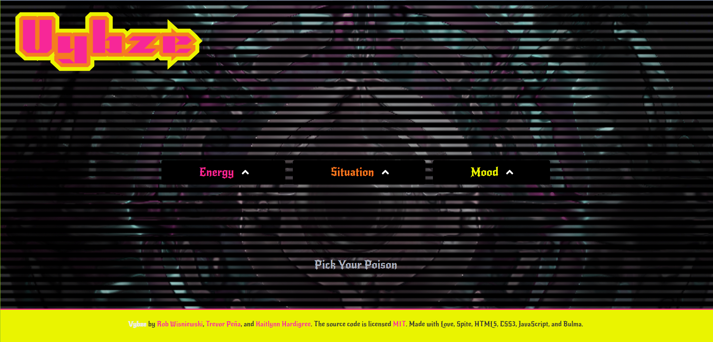
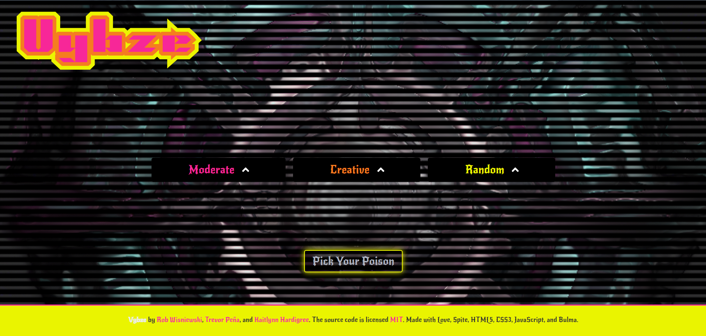
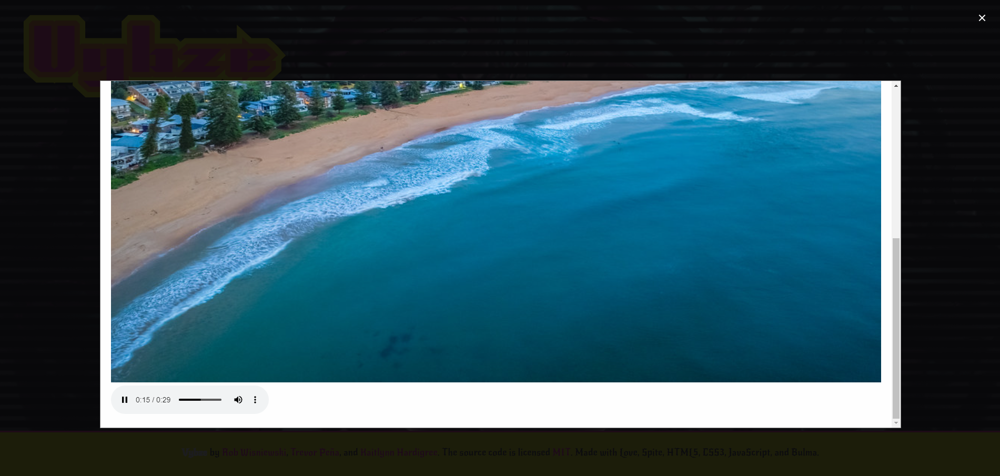

# Project Name: VYBZE

---

## Description:
VYBZE is a web application designed to curate music and imagery based on user-selected tags related to energy, situation, and mood. Users can select tags from dropdown menus corresponding to these categories, triggering a search for relevant tracks on Spotify and fetching associated images from Flickr. The application aims to provide a dynamic and immersive experience for users seeking music and visual content tailored to their desired atmosphere.

---

## Features:
- **Tag-Based Search:** Users can select tags from predefined categories including energy, situation, and mood to personalize their content preferences.
- **Dynamic Audio Playback:** VYBZE utilizes the Spotify API to search for and play audio tracks matching the selected tags, offering a seamless listening experience.
- **Imagery Integration:** The application fetches images from Flickr based on user-selected tags, displaying them in a slideshow to complement the music playback.
- **Modal Interaction:** Modal windows are used for tag selection and content presentation, enhancing user engagement and interaction.

---

## Technologies Used:
- HTML5
- CSS3 (Bulma framework)
- JavaScript (ES6+)

---

## Dependencies:
- Bulma CSS Framework
- Font Awesome (v5.14.0)
- Spotify API
- Flickr API

---

## Installation:
1. Clone the repository: `git clone https://github.com/khardigree/vybze.git`
2. Navigate to the project directory: `cd vybze`
3. Open `index.html` in a web browser.
4. You can also navigate to the url on any browser: 

---

## Usage:
1. Open the application in a web browser.
<figure>
    <figcaption>Vybze Landing Page</figcaption>
    
  </figure>
2. Select tags for energy, situation, and mood from the dropdown menus.
<figure>
    <figcaption>Vybze Selections</figcaption>
    
  </figure>
3. Click the "Pick Your Poison" button to initiate content retrieval and presentation.
<figure>
    <figcaption>Curated Vybze</figcaption>
    
  </figure>
4. Enjoy the curated music tracks and accompanying imagery.

---

## Contributors:
- Rob Wisniewski
- Trevor Peña
- Kaitlynn Hardigree

---

## License:
This project is licensed under the MIT License. See the [LICENSE](LICENSE) file for details.

---

## Acknowledgements:
Special thanks to the creators of Bulma, Font Awesome, Spotify API, and Flickr API for their invaluable contributions to this project.

---

## Contact Information:
For inquiries or feedback, please contact the project maintainers:
- Rob Wisniewski: [GitHub](https://github.com/contra19)
- Trevor Peña: [GitHub](https://github.com/trevorapena)
- Kaitlynn Hardigree: [GitHub](https://github.com/khardigree)

---

## Project Demo:
Include a link to a live demo of the project if available.
